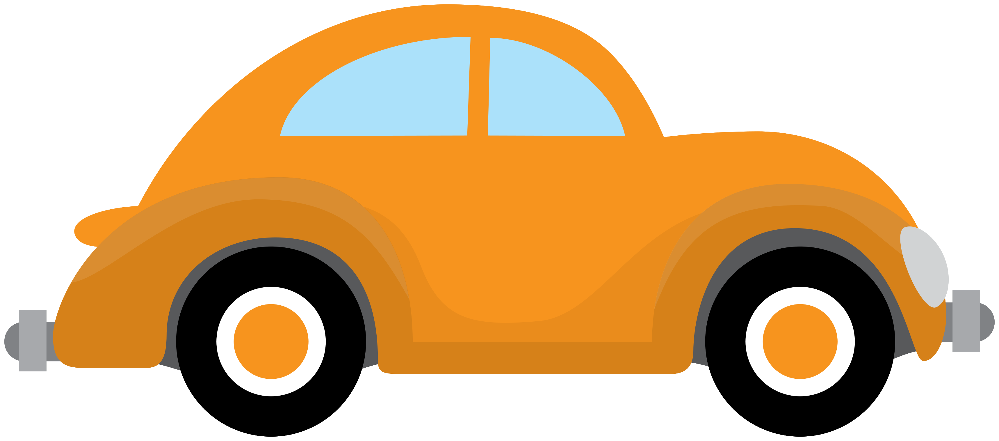

# Latihan OOP JavaScript

Latihan kali ini akan membantu menguji kemampuanmu dalam memahami dan menguasai OOP, diantaranya:
1. Konsep Class pada javascript.
2. Konsep overidding dan overloading method.
3. Static method.
4. Encapsulation atau visibility pada ruang lingkup class.
5. Cara menginstansiasi class
6. Polymorphism


## Susunan direktori project
berikut ini adalah susunan direktori project yang akan kamu kerjakan:
```bash
├── assets
│   ├── css
│   │   └── style.css
│   ├── img
│   │   ├── background.jpg
│   │   └── banner.png
│   └── js
│       ├── events.js
│       ├── parent-class.js
│       └── vehicles.js     # file yang akan kamu modifikasi
├── index.html
└── README.md
```

## Objective
Hasil akhirnya adalah menambahkan berbagai jenis kendaraan menjadi koleksimu.

Berikut ini flow Penggunaan Kendaraan dan Fungsi Keyboard:
1. Pilih Kendaraan,
2. Klik Start Engine,
3. Tekan tombol panah kekanan untuk maju *->*
4. Tekan tombol panah kekiri untuk mundur *<-*
5. Tekan tombol spasi atau tombol berlawanan untuk berhenti

Pahami isi class yang ada pada file `assets/js/parent-class.js` (kamu tidak di izinkan memodifikasi nya).  

Class `Vehicle` memiliki 3 property utama, yaitu:
1. `body`: untuk menampilkan body kendaraan, kamu bisa isi dengan url gambar atau menggunakan asset-asset yang ada di folder `assets/img`. misal `"body": "assets/img/oop-car-sedan.png"`
2. `name`: nama kendaraan untuk di tampilkan di papan atas
3. `speed`: untuk menentukan kecepatan maksimal kendaraan. `speed` pada vehicle adalah satuan pixel, dengan asumsi 1px = 1kmph. jadi misal speed diisi dengan nilai `100` artinya kecepatan kendaraan adalah `100` kilometer per jam.

Modifikasi file `assets/js/vehicles.js` untuk mengerjakan latihan kamu. Tugas yang akan kamu kerjakan adalah berikut:

### 1. Membuat class Car
- Buatlah class bernama `Car` yang bersifat **abstract** dengan meng-`extends` class `Vehicle`.
- Buatlah class bernama `Sedan` dengan dengan meng-`extends` class `Car` dan tidak boleh ada parameter pada `constructor`-nya. name, body dan speed dibuat berbeda dari yang lain.
- Buatlah class bernama `Van` dengan dengan meng-`extends` class `Car` dan tidak boleh ada parameter pada `constructor`-nya. name, body dan speed dibuat berbeda dari yang lain.
- Buatlah class bernama `Bus` dengan dengan meng-`extends` class `Car` dan tidak boleh ada parameter pada `constructor`-nya. name, body dan speed dibuat berbeda dari yang lain.
- Kamu bebas menambahkan property apapun di sub class
- Kamu boleh mengoverride method `info()` dari parent class

### 2. Membuat class MotorCycle
- Buatlah class bernama `MotorCycle` yang bersifat **abstract** dengan meng-`extends` class `Vehicle`.
- Buatlah class bernama `MotorChopper` dengan dengan meng-`extends` class `MotorCycle` dan tidak boleh ada parameter pada `constructor`-nya. name, body dan speed dibuat berbeda dari yang lain.
- Buatlah class bernama `MotorCross` dengan dengan meng-`extends` class `MotorCycle` dan tidak boleh ada parameter pada `constructor`-nya. name, body dan speed dibuat berbeda dari yang lain.
- Buatlah class bernama `MotorSport` dengan dengan meng-`extends` class `MotorCycle` dan tidak boleh ada parameter pada `constructor`-nya. name, body dan speed dibuat berbeda dari yang lain.
- Perlu diingat bahwa **MotorCycle** tidak bisa mundur.
- Kamu bebas menambahkan property apapun di sub class
- Kamu boleh mengoverride method `info()` dari parent class

### 3. Membuat class Bicycle
- Buatlah class bernama `Bicycle` dengan meng-`extends` class `MotorCycle` tanpa parameter pada constructor
- Perlu diingat **Bycycle** tidak memiliki mesin, jadi pastikan class `Bicycle` langsung `startEngine` saat pertama kali `build` agar bisa langsung berjalan.
- Pastikan `speed` bicycle lebih lambat dari `MotorCycle`
- Kamu bebas menambahkan property apapun di sub class
- Kamu boleh mengoverride method `info()` dari parent class

### 4. Tambahkan daftar vehicles
Pastikan semua class memiliki static method dengan nama `buy` yang return value nya adalah class itu sendiri yang sudah di instansiasi. Sebetulnya kamu tidak perlu membuat method `buy` di setiap class yang kamu buat, kamu boleh menerapkan konsep polymorphism untuk mempersingkatnya.  
Pada file `assets/js/vehicles.js` terdapat const yang bernama `vehicles` dengan tipe data array, tambahkan isinya dengan contoh sebagai berikut:

```javascript
// file: assets/js/vehicles.js

// ... deklarasikan class kamu disini

Vehicle.add(Sedan.buy())
Vehicle.add(Van.buy()) 
Vehicle.add(Bus.buy())
Vehicle.add(MotorChopper.buy())
Vehicle.add(MotorCross.buy())
Vehicle.add(MotorSport.buy())
Vehicle.add(Bicycle.buy())

```

### Optional (Custom Vehicle dan Jarak Tempuh)
Buat 1 jenis kendaraan lagi yang belum ada untuk didaftarkan kedalam daftar kendaraanmu, misal `Truck`.   

Tambahkan jarak tempuh untuk setiap kali kendaraan-kendaraanmu bergerak baik maju maupun mundur. sebagai clue, kamu bisa memanggil method `getPosition` untuk mengetahui posisi sekarang dalam satuan pixel atau mengoverride method `moveForward` dan `moveBackward`. Setelah berhasil menambahkan jarak tempuh, sertakan total jarak tempuh untuk ditampilkan di dalam kotak info (kanan atas).